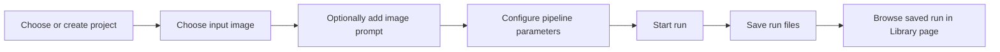
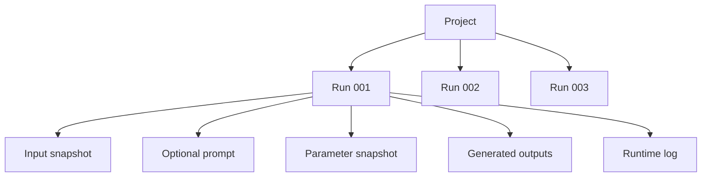

# LazyLayerzzz Library

**Status:** Initial implementation
**Schema version:** 1

## Purpose

`LazyLayerzzzLibrary` is the file-based workspace used by the desktop application to organize projects and preserve generator runs.

The library keeps generated work understandable outside the application.

A user should be able to open the library in Finder and locate:

- Projects.
- Input-image snapshots.
- Optional image-generation prompts.
- Generator parameters.
- Generated outputs.
- Runtime logs.

The library does not currently use a database.

The files and folders inside the library are the source of truth.

---

## Current scope

The initial library supports this workflow:



The first implementation is focused on organization and persistence.

It does not yet include:

- Quality inspection.
- Pass or fail decisions.
- Annotations.
- Input deduplication.
- Prompt versioning.
- Trend analysis.
- Fabrication tracking.
- Etsy preparation.
- Cloud synchronization.

---

## Root structure

```text
LazyLayerzzzLibrary/
├── vault.json
└── projects/
    ├── chicago-skyline/
    └── celtic-tree/
```

### `vault.json`

`vault.json` identifies the directory as a LazyLayerzzz library.

Example:

```json
{
  "schemaVersion": 1,
  "name": "LazyLayerzzz Library",
  "createdAt": "2026-07-11T09:00:00-05:00"
}
```

### `projects/`

Each child directory represents one artwork or design effort.

A project may contain many generator runs.

---

## Project structure

```text
projects/
└── chicago-skyline/
    ├── project.json
    └── runs/
        ├── run-20260711-001/
        └── run-20260711-002/
```

Example `project.json`:

```json
{
  "schemaVersion": 1,
  "projectId": "chicago-skyline",
  "title": "Chicago Skyline",
  "createdAt": "2026-07-11T09:20:00-05:00"
}
```

A project ID:

- Must be unique.
- Uses lowercase letters and hyphens.
- Should remain stable after creation.
- Must not be silently reused or overwritten.

Example conversion:

```text
Chicago Skyline 2014–2026
```

becomes:

```text
chicago-skyline-2014-2026
```

---

## Main relationships



A project represents the overall artwork.

A run represents one execution of the generator.

Every run preserves its own:

- Input image.
- Optional prompt.
- Parameters.
- Outputs.
- Runtime result.

---

## Source-of-truth rule

The desktop Library page must load projects and runs from disk.

It should read:

```text
LazyLayerzzzLibrary/projects/*/project.json
LazyLayerzzzLibrary/projects/*/runs/*/run.json
```

It must not depend on temporary React state from the most recent run.

The library is working correctly when saved projects and runs still appear after the desktop application is closed and reopened.

---

## File handling rules

### Input files

The selected input image is copied into the run.

The original selected file must not be moved or deleted.

### Generated outputs

During the initial implementation, the existing Python pipeline may continue creating its normal output directories.

After the pipeline finishes, the desktop backend copies those directories into the saved run.

The original pipeline output directories must not be moved or deleted.

### Existing runs

Starting a new run must never reuse an existing run directory.

Every run receives a unique ID.

### Optional prompt

An image-generation prompt is optional.

The wood-art pipeline does not consume the prompt.

The prompt is stored only to preserve how the input image was created and to support future tuning.

---

## Git behavior

The local library is generated user data and must not be committed to Git.

The repository root `.gitignore` should include:

```gitignore
/LazyLayerzzzLibrary/
```

Architecture documentation remains committed under `docs/`.
