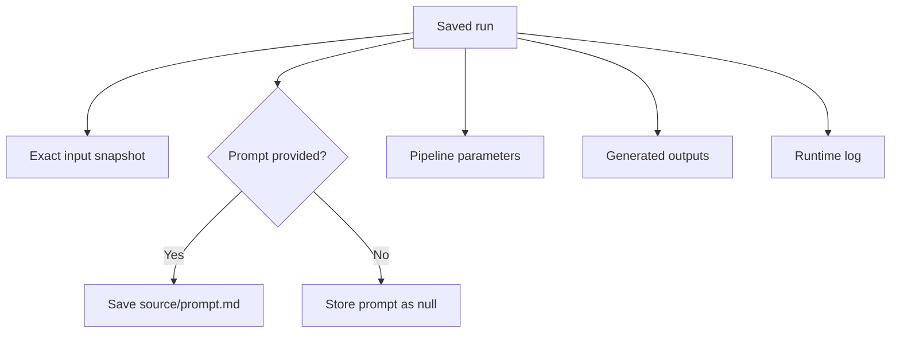
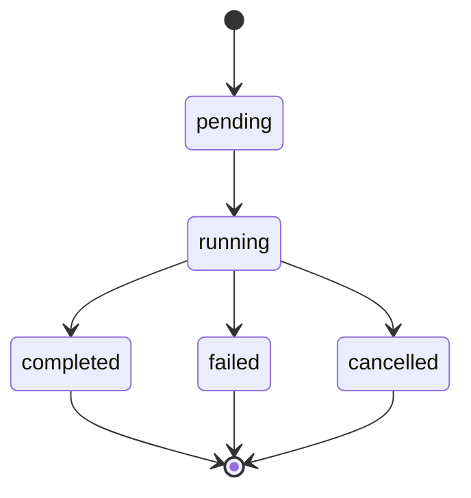
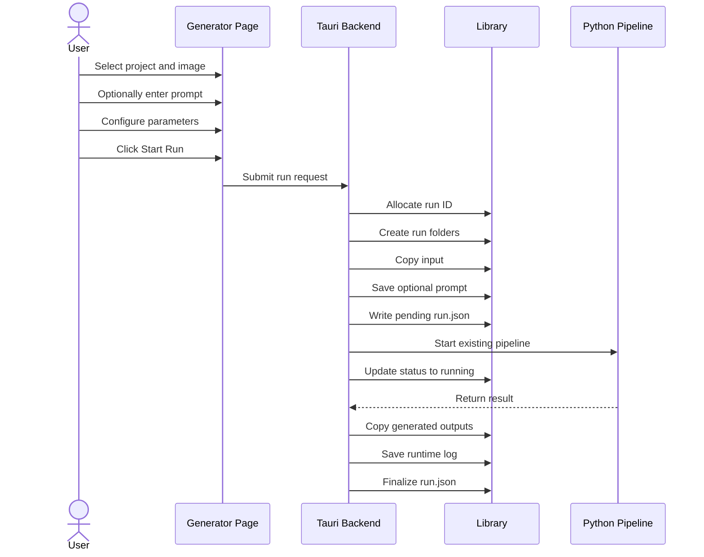

# Saved Run Format

**Status:** Initial implementation
**Schema version:** 1

## Purpose

A run represents one execution of the generator.

A run preserves the exact information needed to understand what was processed and what the pipeline produced.

A new execution always creates a new run.

---

## Run directory

```text
run-20260711-001/
├── run.json
├── source/
│   ├── input.png
│   └── prompt.md
├── outputs/
│   ├── generator/
│   ├── postprocessed/
│   └── final/
└── logs/
    └── runtime.log
```

`prompt.md` is optional.

The copied input should preserve its original extension:

```text
source/input.png
source/input.jpg
source/input.webp
```

---

## Run ownership



The prompt belongs to the saved run.

It is not automatically added to a reusable prompt library.

A future feature may promote useful prompts into a reusable library, but that is outside the initial contract.

---

## Run ID

Run IDs use:

```text
run-YYYYMMDD-NNN
```

Examples:

```text
run-20260711-001
run-20260711-002
run-20260711-003
```

The numeric portion must make the ID unique within the project for that date.

An existing run ID must never be reused.

---

## Run lifecycle



### Status meanings

| Status      | Meaning                                         |
| ----------- | ----------------------------------------------- |
| `pending`   | Run directory exists but Python has not started |
| `running`   | The Python pipeline is executing                |
| `completed` | The pipeline finished successfully              |
| `failed`    | The pipeline returned an error                  |
| `cancelled` | Execution was intentionally stopped             |

Failed runs must be preserved.

---

## Run creation sequence



---

## Minimal `run.json`

Example with a prompt:

```json
{
  "schemaVersion": 1,
  "runId": "run-20260711-001",
  "projectId": "chicago-skyline",
  "status": "completed",
  "createdAt": "2026-07-11T09:30:00-05:00",
  "startedAt": "2026-07-11T09:30:05-05:00",
  "finishedAt": "2026-07-11T09:37:42-05:00",
  "source": {
    "originalFilename": "chicago_skyline_v2.png",
    "inputPath": "source/input.png"
  },
  "prompt": {
    "path": "source/prompt.md"
  },
  "parameters": {
    "supportBridgesPerPatch": 10,
    "mergeVisibleFraction": 0.02,
    "omegaBudgetFactor": 0.015,
    "generateCompositePreview": true,
    "generateShowcasePreview": true
  },
  "outputs": {
    "generator": "outputs/generator",
    "postprocessed": "outputs/postprocessed",
    "final": "outputs/final"
  },
  "runtimeLogPath": "logs/runtime.log",
  "exitCode": 0
}
```

Example without a prompt:

```json
{
  "prompt": null
}
```

The actual `parameters` object should contain the values currently supported by the desktop generator form.

---

## Prompt rules

The prompt field should be labeled:

```text
Image-generation prompt — optional
```

Recommended helper text:

```text
Save the prompt used to create this input image. The wood-art pipeline
does not require it. Saving the prompt supports future image and
pipeline tuning.
```

When the prompt field contains only whitespace:

- Treat it as empty.
- Do not create `prompt.md`.
- Store `"prompt": null`.

When the prompt contains text:

- Preserve its multiline formatting.
- Save it to `source/prompt.md`.
- Store the relative path in `run.json`.

The prompt must not be added to the Python command.

---

## Output handling

For the initial implementation, the Python pipeline may continue producing its current output directories.

After execution, copy them into:

```text
outputs/generator/
outputs/postprocessed/
outputs/final/
```

Nested directories must be copied recursively.

This includes:

```text
outputs/final/previews/
outputs/final/previews/showcase/
```

The original pipeline output directories remain untouched.

---

## Immutability rule

After a run finishes, the following files should not be silently replaced:

- Input snapshot.
- Prompt snapshot.
- Parameter snapshot.
- Runtime log.
- Generator outputs.
- Postprocessed outputs.
- Final outputs.
- Completion status.
- Exit code.

A retry creates a new run rather than modifying the old one.

---

## Library-page requirements

The Library page should show:

- Run ID.
- Project title.
- Run status.
- Original input filename.
- Whether a prompt was saved.
- Creation time.
- Parameter values.
- Saved output paths.
- Runtime log path.

Initial actions:

```text
Open Run Folder
Open Final Output Folder
Back to Generator
```

DXF and PNG rendering are not required in the initial implementation.
